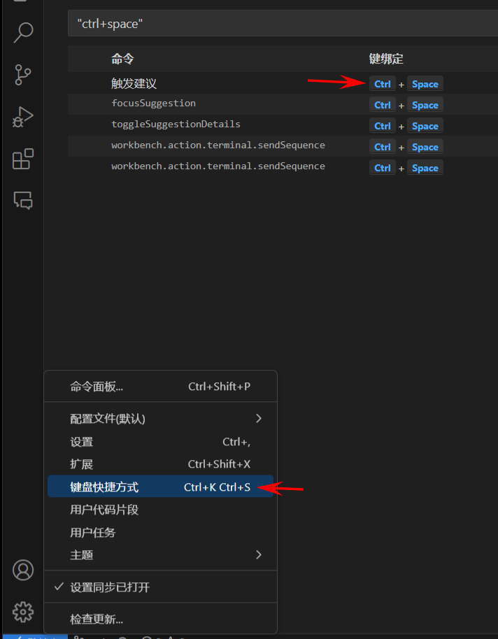
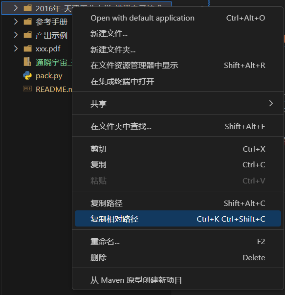

# 大学拍照搜题数据标注相关

## 环境
- 插件 `redhat.vscode-xml`
- Python 3

## 使用
每份pdf新建文件夹 `xxx.pdf` 其中是每道题目文件夹（包含一个xml文件和若干图片）

插件已配置好，会自动对工作路径中的xml文件进行提示。

默认的提示快捷键是 `Ctrl+Space`，可以通过下面的方式修改：

已配置的代码片段：
触发关键词|介绍
-|-
init|初始化标注元数据
now|插入当前时间
space|插入答案分割符

## 打包
选中要打包的目录（摁住Ctrl可多选），右键选择复制相对路径，然后运行 `pack.py` 即可。

## 注意
题目文件夹命名无需添加时间戳，打包程序会自动获取xml文件中的流水线时间戳。
